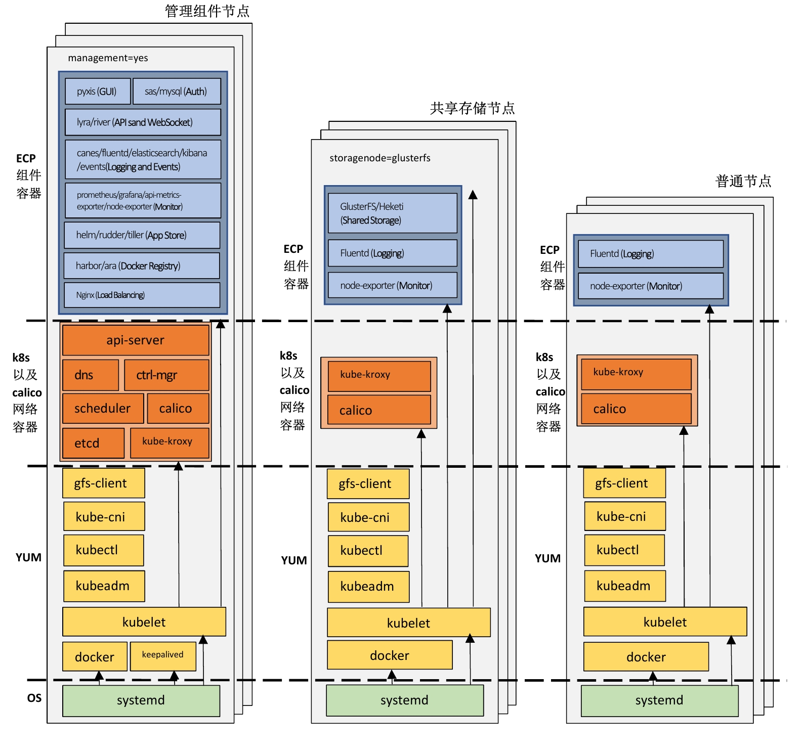
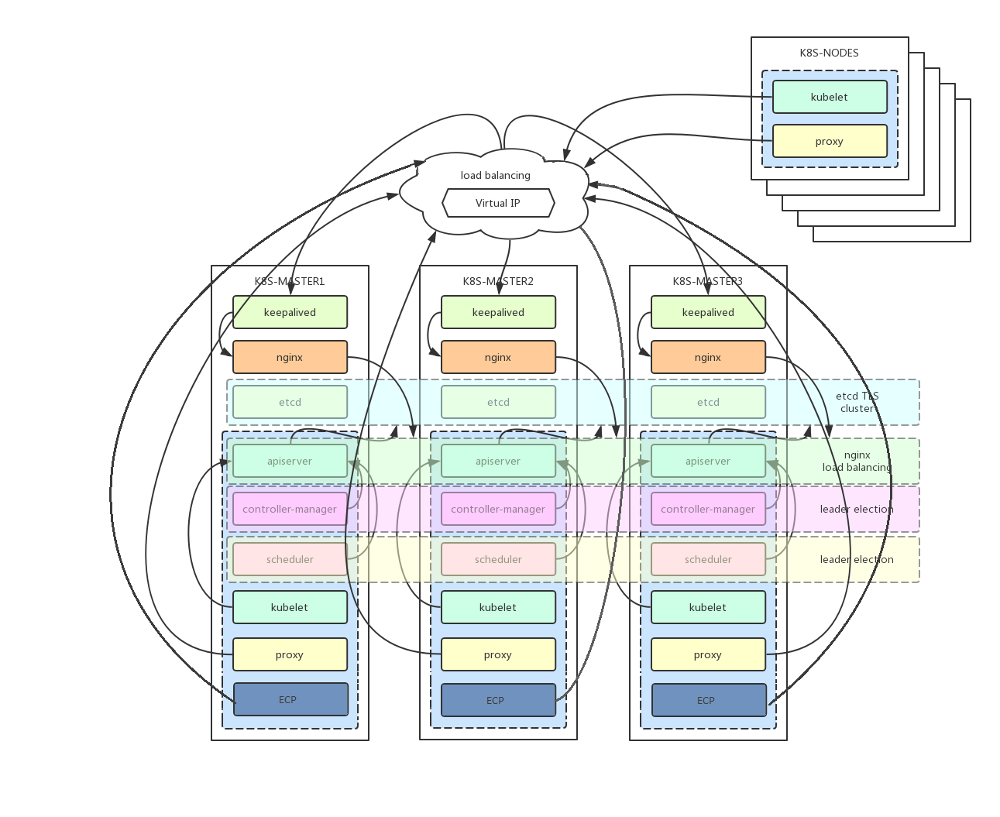

# ECP Ansible Playbook
Build an ECP cluster using Ansible. The underlying kubernetes is installed with Kubeadm.

## System requirement:
* Deploy node must have `Ansible v2.4.2+` installed.
* All Nodes should have password-less access from the Deploy node.
* All hosts must have `Docker` installed. Verified with `Docker 1.12`.
* Verified on `CentOS Linux release 7.4.1708 (Core)`

## Install
### Deployment Architecture
The following diagram illustrates the different components of ECP, and the types of nodes where these components are installed.


#### **Management nodes**
Also called master nodes. These are the nodes where kubernetes master components and ECP management components are installed. If there are more than one management nodes, high availability will be enabled. See High Availability section for more details on the behavior of high availability.

#### **GlusterFS nodes**
These are the nodes for GlusterFS shared storage, if you choose to let the installer install and configure GlusterFS shared storage solution for ECP. GlusterFS nodes should be separate from the management nodes in an HA environment.
If you choose to use external shared storage solutions, the GlusterFS nodes are not needed.

#### **Worker nodes**
These are the nodes to run user applications and services.

### High Availability
The following diagram illustrates more details on the high availability architecture:

* The recommended number of master hosts is three.
* **etcd** cluster is installed on the master hosts for data store. It is shared by kubernetes, calico, and ecp components.
* **keepalived** cluster is installed on the master hosts to enable virtual IP for the kubernetes api server. It checks the api server health by probing port 6443 on the local host.
* **nginx** daemonset is installed on the master hosts to enable load balancing of api requests from worker nodes through port 8443.
* All api requests initiated from within the master hosts (i.e., kubelet, controller-manager, scheduler) are directed to the api server on the local host and port 6443.
* The **kube-proxy** on all hosts is configured to access api server via the virtual IP and the nginx port (8443).
* All ecp services access api server via the virtual IP and the nginx port.

### GlusterFS
The installer can install GlusterFS for you, and then create a shared volume (i.e., /ecp_share) out of the GlusterFS storage to store critical data for ECP, such as harbor image repository, appstore application charts, and monitoring/logging data. See **internal_glusterfs**, **gluster_ecp_volume_size**, **ecp_share_dir** parameteres in *group_vars/all.yml* for more details.

You must configure a separate block device (e.g., /dev/sdb) on all gluster hosts, and configure them in the glusterfs hosts section in the *inventory* file.

### Plan your install
Depending on your situation, you need to decide if you should do online or offline installation, and if you want to enable High Availability. 

To perform offline installation, you must first prepare the offline installation package which contains all the required RPM packages and docker image tar files. To prepare the offline installation, follow the instruction in the [offline package repository](https://github.com/rivernetio/tools)

#### Edit the `inventory` file. 
For example, the following inventory file specify three master candidate hosts, and three worker hosts. Because HA is enabled, a virtual IP is also configured. The inventory file also configures the glusterfs hosts, and the corresponding device to be used for glusterfs storage.
```
# Must specify all hosts in IPv4 address format. Host name is not supported.
# All hosts must have passwordless ssh between other as root.
# Make sure to modify group_vars/all.yml to correctly specify all values.

# Kubernetes master nodes.
#
# High availability is supported when:
#  - There are more than one master, and
#  - The IP addresses are all in the same subnet (/24), and
#  - A virtual IP address (i.e. [cluster:vars]) in the
#    same subnet is configured.
#
# The recommended number of masters are three.
[masters]
10.211.64.105
10.211.64.107
10.211.64.109

# Kubernetes worker (non-master) nodes.
# Currently you must specify at least two worker nodes, such that there are
# at least three nodes in the cluster. Gluster FS, which requires at least
# 3 hosts  will be installed in the same cluster.
[workers]
10.211.64.111
10.211.64.113
10.211.64.115

[cluster:children]
masters
workers

# Virtual API server IP for the cluster. Must be specified for HA.
[cluster:vars]
vip=10.211.64.120

# Inventory for Gluster FS nodes.
# All Gluster FS nodes must also be kubernetes nodes.
#
# For production cluster, glusterfs nodes must be different than the master
# nodes defined in the inventory.
#
# The glusterfs_devices and glusterfs_hostname variables are used by the
# installer to generate the proper topology file for glusterfs deployment.
[glusterfs]
10.211.64.111 glusterfs_devices='["/dev/sdb"]' glusterfs_hostname='kube11'
10.211.64.113 glusterfs_devices='["/dev/sdb"]' glusterfs_hostname='kube13'
10.211.64.115 glusterfs_devices='["/dev/sdb"]' glusterfs_hostname='kube15'
```

#### Customize ```group_vars/all.yml```
Modify the following variables according to your site.

### Run the `install.yml` playbook:
```sh
$ ansible-playbook -v install.yml
...
TASK [ecp : Create events rc] *******************************************************************************************************
changed: [10.211.64.105] => {"changed": true, "cmd": "kubectl --kubeconfig=/etc/kubernetes/admin.conf create -f /etc/kubernetes/ecp/events/events-controller.yaml", "delta": "0:00:00.299579", "end": "2018-01-30 22:52:25.788120", "rc": 0, "start": "2018-01-30 22:52:25.488541", "stderr": "", "stderr_lines": [], "stdout": "replicationcontroller \"firmament-events\" created", "stdout_lines": ["replicationcontroller \"firmament-events\" created"]}

TASK [ecp : Create events service] **************************************************************************************************
changed: [10.211.64.105] => {"changed": true, "cmd": "kubectl --kubeconfig=/etc/kubernetes/admin.conf create -f /etc/kubernetes/ecp/events/events-service.yaml", "delta": "0:00:00.677848", "end": "2018-01-30 22:52:27.352944", "rc": 0, "start": "2018-01-30 22:52:26.675096", "stderr": "", "stderr_lines": [], "stdout": "service \"events-firmament-com\" created", "stdout_lines": ["service \"events-firmament-com\" created"]}

PLAY RECAP **************************************************************************************************************************
10.211.64.105              : ok=257  changed=194  unreachable=0    failed=0
10.211.64.107              : ok=61   changed=26   unreachable=0    failed=0
10.211.64.109              : ok=57   changed=26   unreachable=0    failed=0
10.211.64.111              : ok=29   changed=13   unreachable=0    failed=0
10.211.64.113              : ok=29   changed=13   unreachable=0    failed=0
10.211.64.115              : ok=25   changed=13   unreachable=0    failed=0
```

### Verify
```sh
[root@kube07 vagrant]# kubectl get po --all-namespaces -o wide
NAMESPACE       NAME                                             READY     STATUS    RESTARTS   AGE       IP                NODE
default         glusterfs-1xw63                                  1/1       Running   0          23h       10.211.64.115     kube15
default         glusterfs-kg6f8                                  1/1       Running   0          23h       10.211.64.111     kube11
default         glusterfs-t6hm2                                  1/1       Running   0          23h       10.211.64.113     kube13
default         heketi-2422963060-z6j5f                          1/1       Running   0          23h       192.168.71.193    kube07
default         jupyter-jupyter-3550354844-dp7j7                 1/1       Running   0          23h       192.168.239.140   kube09
harbor          docker-cdw50                                     1/1       Running   0          23h       192.168.199.67    kube05
harbor          mysql-h1p0c                                      1/1       Running   0          23h       192.168.71.194    kube07
harbor          proxy-5nh7b                                      1/1       Running   0          23h       192.168.239.131   kube09
harbor          registry-39h52                                   1/1       Running   0          23h       192.168.239.130   kube09
harbor          ui-chtz4                                         1/1       Running   0          23h       192.168.71.195    kube07
kube-system     calico-node-47c06                                2/2       Running   0          23h       10.211.64.111     kube11
kube-system     calico-node-4g8p4                                2/2       Running   0          23h       10.211.64.107     kube07
kube-system     calico-node-chlsw                                2/2       Running   0          23h       10.211.64.109     kube09
kube-system     calico-node-n6zs1                                2/2       Running   0          23h       10.211.64.115     kube15
kube-system     calico-node-qg4s4                                2/2       Running   1          23h       10.211.64.113     kube13
kube-system     calico-node-w7p4v                                2/2       Running   0          23h       10.211.64.105     kube05
kube-system     calico-policy-controller-975587260-b53xv         1/1       Running   0          23h       10.211.64.105     kube05
kube-system     helm-rudder-617253635-x3gwt                      2/2       Running   0          23h       192.168.71.197    kube07
kube-system     kube-api-exporter-766554028-nv9j5                1/1       Running   0          23h       192.168.71.199    kube07
kube-system     kube-apiserver-kube05                            1/1       Running   0          23h       10.211.64.105     kube05
kube-system     kube-apiserver-kube07                            1/1       Running   0          23h       10.211.64.107     kube07
kube-system     kube-apiserver-kube09                            1/1       Running   0          23h       10.211.64.109     kube09
kube-system     kube-controller-manager-kube05                   1/1       Running   1          23h       10.211.64.105     kube05
kube-system     kube-controller-manager-kube07                   1/1       Running   0          23h       10.211.64.107     kube07
kube-system     kube-controller-manager-kube09                   1/1       Running   0          23h       10.211.64.109     kube09
kube-system     kube-dns-2425271678-tvbjn                        3/3       Running   0          23h       192.168.199.65    kube05
kube-system     kube-proxy-79bxb                                 1/1       Running   0          23h       10.211.64.105     kube05
kube-system     kube-proxy-9pk97                                 1/1       Running   0          23h       10.211.64.113     kube13
kube-system     kube-proxy-dwzsh                                 1/1       Running   0          23h       10.211.64.109     kube09
kube-system     kube-proxy-h189l                                 1/1       Running   1          23h       10.211.64.115     kube15
kube-system     kube-proxy-k8nkv                                 1/1       Running   1          23h       10.211.64.111     kube11
kube-system     kube-proxy-s9vps                                 1/1       Running   0          23h       10.211.64.107     kube07
kube-system     kube-scheduler-kube05                            1/1       Running   1          23h       10.211.64.105     kube05
kube-system     kube-scheduler-kube07                            1/1       Running   0          23h       10.211.64.107     kube07
kube-system     kube-scheduler-kube09                            1/1       Running   0          23h       10.211.64.109     kube09
kube-system     kube-state-metrics-deployment-3234364931-tcq3l   1/1       Running   0          23h       192.168.239.136   kube09
kube-system     kubernetes-dashboard-768341277-gpnfc             1/1       Running   0          23h       192.168.199.66    kube05
kube-system     nginx-lb-j0lf9                                   1/1       Running   0          23h       10.211.64.105     kube05
kube-system     nginx-lb-sn5bl                                   1/1       Running   0          23h       10.211.64.107     kube07
kube-system     nginx-lb-t1ggp                                   1/1       Running   0          23h       10.211.64.109     kube09
kube-system     river-4191847710-3z0rz                           1/1       Running   0          23h       192.168.239.133   kube09
kube-system     tiller-deploy-3694163333-szh7m                   1/1       Running   0          23h       192.168.239.134   kube09
sky-firmament   custom-metrics-apiserver-3146564623-l7zrn        1/1       Running   0          23h       192.168.239.137   kube09
sky-firmament   firmament-ara-shpd6                              1/1       Running   0          23h       192.168.239.138   kube09
sky-firmament   firmament-events-vmf18                           1/1       Running   0          23h       192.168.199.71    kube05
sky-firmament   firmament-license-2fqx3                          1/1       Running   0          23h       192.168.239.132   kube09
sky-firmament   firmament-lyra-jrcg6                             1/1       Running   0          23h       192.168.71.196    kube07
sky-firmament   firmament-mysql-92qlr                            1/1       Running   0          23h       192.168.199.68    kube05
sky-firmament   firmament-pyxis-fs9gg                            1/1       Running   0          23h       192.168.239.139   kube09
sky-firmament   grafana-core-2251161593-4vgh3                    1/1       Running   0          23h       192.168.71.198    kube07
sky-firmament   prometheus-core-2626112434-96np1                 1/1       Running   0          23h       192.168.199.70    kube05
sky-firmament   prometheus-node-exporter-56q49                   1/1       Running   0          23h       10.211.64.107     kube07
sky-firmament   prometheus-node-exporter-5k5mk                   1/1       Running   0          23h       10.211.64.113     kube13
sky-firmament   prometheus-node-exporter-7x8sr                   1/1       Running   0          23h       10.211.64.109     kube09
sky-firmament   prometheus-node-exporter-87z1k                   1/1       Running   0          23h       10.211.64.105     kube05
sky-firmament   prometheus-node-exporter-nkg2d                   1/1       Running   0          23h       10.211.64.111     kube11
sky-firmament   prometheus-node-exporter-pxk0z                   1/1       Running   0          23h       10.211.64.115     kube15
sky-firmament   skyform-sas-87rlm                                2/2       Running   0          23h       192.168.199.69    kube05
```

### Destroy
```sh
$ ansible-playbook destroy.yml
```

### Add worker nodes
* Edit the `inventory` file. For example, the following inventory file specify one new worker node.

```
# Specify new worker nodes during scale up
[new_workers]
10.211.64.116
```

* Run the `install.yml` playbook:
```
ansible-playbook -v scaleup.yml
```

### Upgrade from 1.7.5 to 1.8.3
#### Online upgrade
Run "ansible-playbook -v upgrade.yml"

If upgrade is failed, find your previous k8s manifest files here:

```
[root@node1 ansible-ecp]# ll /etc/kubernetes/manifests_backup/
total 12
-rw-------. 1 root root 2497 Mar  2 21:50 kube-apiserver.yaml
-rw-------. 1 root root 1719 Mar  2 21:50 kube-controller-manager.yaml
-rw---
```

#### Offline upgrade
* Prepare images and rpms

Prepull and load following images to all master nodes:

```
docker.io/rivernet/kube-controller-manager-amd64:v1.8.3
docker.io/rivernet/kube-scheduler-amd64:v1.8.3
docker.io/rivernet/kube-proxy-amd64:v1.8.3
``` 

Prepull and load following images to all master and worker nodes:

```
docker.io/rivernet/kube-proxy-amd64:v1.8.3
```

Download following rpm packages from github "rivernetio/rpm" and put to folder "ansible-ecp/depends/rpm"

```
[root@node1 ansible-ecp]# ll depends/rpm/kubernetes-1.8.3/
total 38828
-rwxrwxrwx. 1 vagrant vagrant 15618410 Mar  2 22:11 kubeadm-1.8.3-0.x86_64.rpm
-rwxrwxrwx. 1 vagrant vagrant  7618130 Mar  2 22:11 kubectl-1.8.3-0.x86_64.rpm
-rwxrwxrwx. 1 vagrant vagrant 16516710 Mar  2 22:11 kubelet-1.8.3-0.x86_64.rpm
```

* Upgrade

Run "ansible-playbook -v upgrade.yml"

If upgrade is failed, find your previous k8s manifest files here:

```
[root@node1 ansible-ecp]# ll /etc/kubernetes/manifests_backup/
total 12
-rw-------. 1 root root 2497 Mar  2 21:50 kube-apiserver.yaml
-rw-------. 1 root root 1719 Mar  2 21:50 kube-controller-manager.yaml
-rw-------. 1 root root  922 Mar  2 21:50 kube-scheduler.yaml
```
